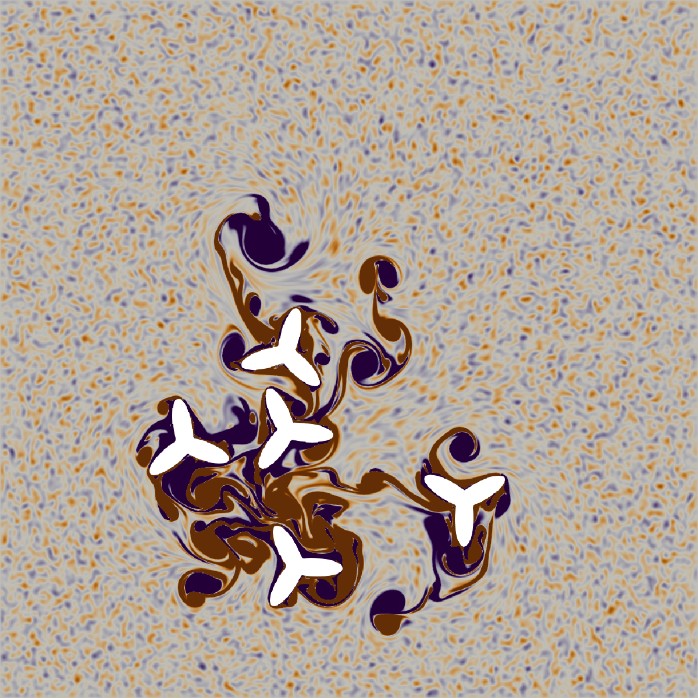

# CubismUP-2D

Incompressible Flow Solver for Complex Deformable Geometries in 2D.

## Dependencies

CubismUP-2D depends on MPI and [GSL - GNU Scientific
Library](https://www.gnu.org/software/gsl).

## Compilation

For CPU
```
make 'CXXFLAGS = '`gsl-config --cflags`' -Ofast' 'LIBS = `gsl-config --libs`'
```

For GPU
```
make 'gpu = true' 'CXXFLAGS = '`gsl-config --cflags`' -Ofast' 'LIBS = `gsl-config --libs`'
```

## Running

```
mpiexec -n 4 sh launch/stefanfish.sh
```
or

```
mpiexec -n 4 sh launch/windmills.sh
```

## Visualize

```
for i in vel.*.xdmf2; do j=${i%.xdmf2}.png; if test ! -f $j; then echo $i $j; fi; done | xargs -r -P `nproc` -n 2 sh -xc 'pvbatch tools/view.py "$@"' sh
```

<p align="center" alt="windmill simulaton snapshot"></p>
